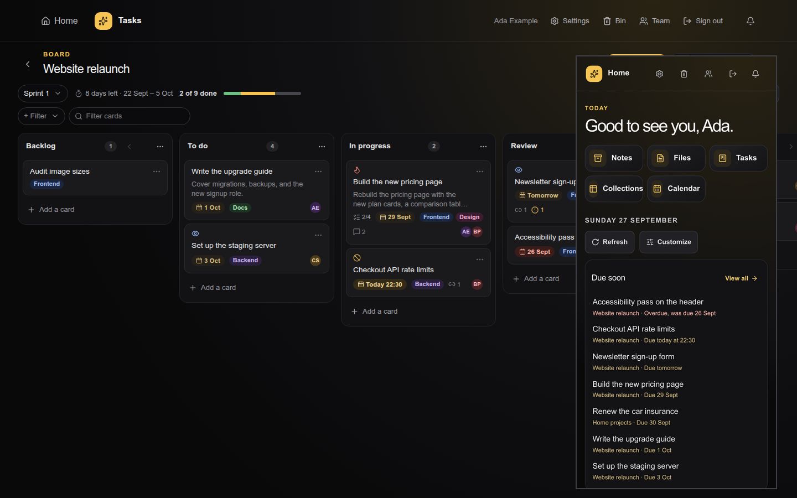
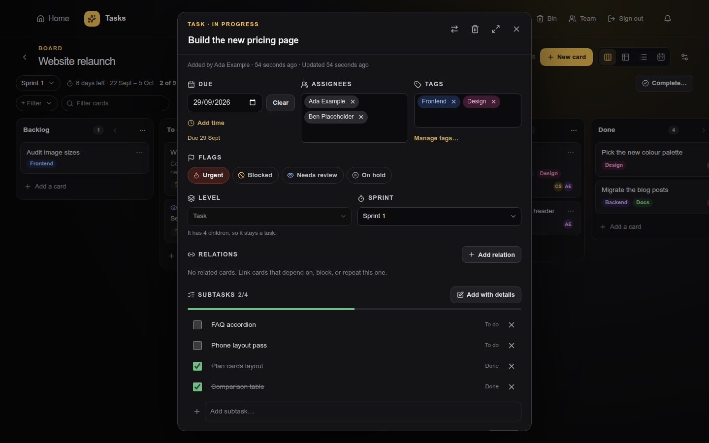
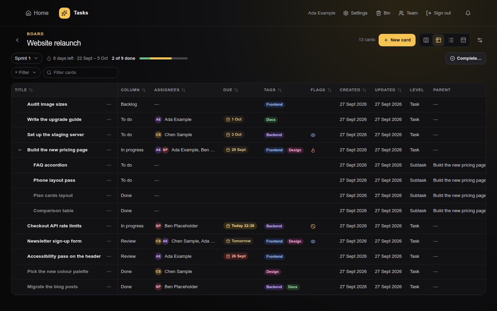
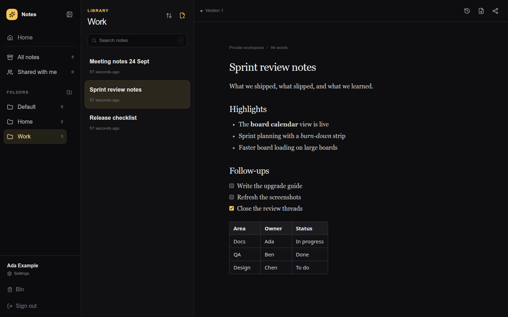
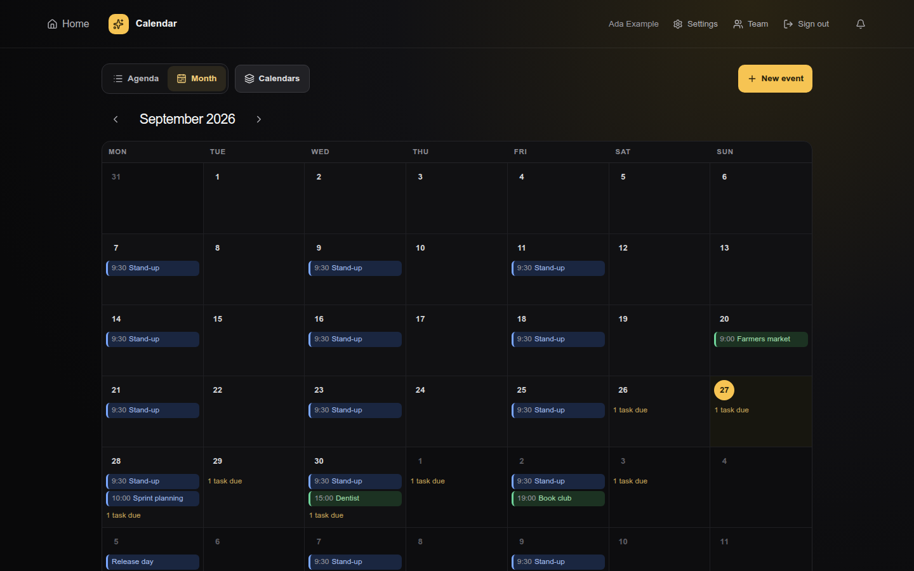

# Nook

**A private, self-hosted workspace for a household or a small trusted team: notes, files, tasks, collections, and calendars in one small Docker container.**

Everything stays on storage you control. Notes are portable Markdown files with immutable version history, files keep their bytes, and nothing is shared until you share it. Built with Bun, Hono, SQLite, React, and Tiptap.

Documentation: [pankajsoni19.github.io/nook](https://pankajsoni19.github.io/nook/)

<p align="center">
  
</p>

## Features

### Today

The home screen shows what needs you now: cards due soon and assigned to you, recent and unpublished notes, drafts written by agents, recent files and collection rows, upcoming events, items leaving the Bin, and your storage use. Sections can be hidden per account.

### Notes

- Markdown editor with slash commands, checklists, code blocks, quotes, pasted or dropped images, and tables.
- Drafts save automatically; **Publish** records an immutable version you can diff and restore.
- **Download as PDF**, folders, and sharing by note or folder.
- Full-text search across titles and bodies: accent- and case-insensitive, prefix and phrase matching, and it never shows what you cannot read.

### Files

- Upload with progress, cancel, and retry; list or thumbnail grid; rename, move, and share in the same folders as notes.
- Inline previews for images, PDFs, text, audio, and video. Types are detected from the file's bytes, and unsafe types (SVG, HTML) are download-only.
- Per-file size limit, per-user quota, and a free-disk floor.

### Tasks

- **Boards** with drag and drop, columns with To do / In progress / Done states, and **WIP limits**.
- **Cards** with due dates and times, multiple assignees, colour **tags**, **flags** (urgent, blocked, needs review, on hold), **relations** (depends on, relates to, duplicates), comments, and attachments.
- A full-screen **card composer** that sets everything in one step, and a full-page card view.
- **Views**: columns, a sortable table, a grouped list, and a calendar with drag-to-reschedule. A filter bar (assignee, tag, flag, due, column, level, sprint, relations) keeps its state in the URL, so filtered views are shareable links.
- **Hierarchy**: Task › Subtask, Epic › Story › Subtask, or your own level names, with subtask checklists, progress, and parent chips.
- **Sprints**: plan, start, and complete sprints, with a sprint switcher, a progress strip, and a carry-over choice for unfinished cards.
- **Templates**: Simple kanban, Personal to-do, Task checklist, Scrum sprint board, Epic › Story › Subtask, Bug triage, and Content pipeline.
- **Tasks home**: **My work** lists everything assigned to you across boards; **saved views** keep a cross-board filter and layout, shared privately, with chosen people, or with everyone, and always evaluated as the viewer.

<p align="center">
  
  
</p>

### Collections

Typed tables for inventories, subscriptions, expenses, recipes, or contacts: text, number, date, checkbox, select, link, note, and file fields; inline editing; sort, filter, and saved views; one-step undo; CSV import and export; and sharing as view-only or can-edit.

### Calendar

Calendars with agenda and month views, repeating events, links to notes, cards, and rows, due cards overlaid on the calendar, and sharing as view-only or can-edit. Reminders arrive in the notification bell and as Web Push on HTTPS, and revocable iCalendar feed links (busy-only or full details) let other calendar apps subscribe.

### Team

- Roles: **admin**, **member**, **viewer** (reads what is shared with them or with everyone, changes nothing), and **guest** (reads only what is shared with them by name). Read-only roles are enforced on the server, not just hidden in the app.
- Admins block and unblock accounts, sign them out everywhere, and see activity. Admins never see anyone's private content.
- New accounts get `SIGNUP_ROLE` (default `guest`). A host CLI (`server/team-admin.ts`) recovers from a lockout.

### Everywhere

- **Shared Bin**: deleted notes, files, cards, boards, collections, rows, calendars, and events wait 30 days with their history and sharing, then are removed for good. A card moves to the Bin with its subtasks.
- **Settings → Modules**: turn apps on or off for your account on every device. Nothing is deleted and sharing is unchanged.
- **Mobile first**: every app, item, and view has its own URL, phones get focused single-column screens, and browser Back and Forward work everywhere (Back closes an open dialog or sheet first).
- **MCP server**: a Streamable HTTP endpoint for trusted AI clients with revocable API keys and per-key permissions across notes (read, write drafts), files (read), tasks (read, write), collections (read, write), calendar (read, write), Today, and team (admins). Agents write drafts; publishing always stays with you.

<p align="center">
  
  
</p>

## Security

- Argon2id passwords, opaque HttpOnly SameSite session cookies, CSRF tokens, a strict Content Security Policy, and an exact browser-origin allowlist.
- Optional or required TOTP two-factor authentication; secrets and recovery codes are encrypted with AES-256-GCM.
- Private by default: the server authorises every read, and search, previews, Today, feeds, and MCP only see what the user may open.
- Hashed API keys and feed tokens, rate limits on sign-in, search, and MCP, and payload-less Web Push to allowlisted push services only.
- A hardened container: non-root user, read-only root filesystem, dropped capabilities, and `no-new-privileges`.
- Verified weekly backups with five-archive retention (`scripts/backup.sh`).

Nook is designed for one host on a trusted network. Prefer HTTPS through Tailscale Serve or a reverse proxy.

## Quick start

You need Git, Docker Engine, and Docker Compose.

```sh
git clone https://github.com/pankajsoni19/nook.git && cd nook
cp .env.example .env            # set ALLOWED_EMAILS, TOTP_POLICY, APP_ORIGINS as needed
sudo mkdir -p /srv/mynotes && sudo chown 1000:1000 /srv/mynotes   # or set MYNOTES_DATA_DIR
APP_VERSION=0.9.0 GIT_SHA=$(git rev-parse --short HEAD) docker compose up -d --build
curl http://localhost:2026/api/health   # then open http://localhost:2026 and create the first account (the admin)
```

Later registrations stay disabled unless you set `ALLOW_REGISTRATION=true`. Internal identifiers such as `mynotes.sqlite`, the `mynotes` container, `MYNOTES_DATA_DIR`, and the `mynotes-*` backup archives keep the original prefix for compatibility.

## Upgrading

Back up first (`./scripts/backup.sh --force`), pull, rebuild, and let migrations run on the first boot. Release-specific steps are in [docs/OPERATIONS.md](docs/OPERATIONS.md#upgrades).

## What's new in v0.9.0

- **Viewer and guest roles** with read-only enforcement on the server; `SIGNUP_ROLE` (default `guest`) sets the role of new accounts.
- **Task hierarchy and sprints**: subtasks, epics and stories, hierarchy templates, sprint planning, and a lighter board payload.
- **Tasks home** with My work and saved cross-board views. Migration 019 runs on the first boot, so back up first.
- **Review and QA fixes**: read-only roles can edit only their private views (with a Make private option for shared ones), Columns view says how many epics it hides with a Show all levels switch, focus moves into sheets and dialogs, and 44 px phone targets.

Earlier releases: [release notes](https://pankajsoni19.github.io/nook/#whats-new).

## Documentation

- [Documentation site](https://pankajsoni19.github.io/nook/): every app, configuration, security, backups, and upgrades.
- [docs/USING.md](docs/USING.md): the user guide for every app, the Bin, Team, Modules, and MCP keys.
- [docs/OPERATIONS.md](docs/OPERATIONS.md): configuration reference, storage, backup and restore, upgrades, and development setup.
- [docs/ARCHITECTURE.md](docs/ARCHITECTURE.md): how the server, storage, and client fit together.
- [DEVELOPMENT_PLAN.md](DEVELOPMENT_PLAN.md), [docs/plan/](docs/plan/), and [TODO.md](TODO.md): plan, API contracts, threat model, and tracker.

Built by [Pankaj Soni](https://github.com/pankajsoni19).
