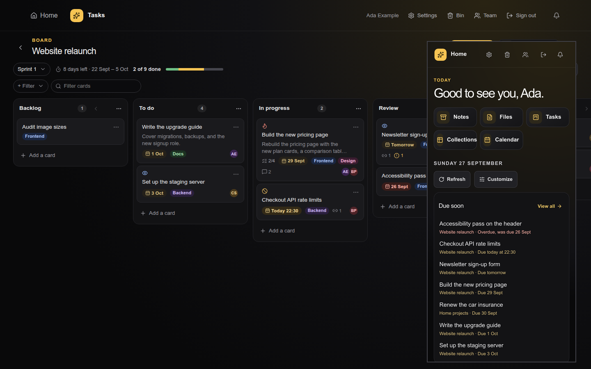
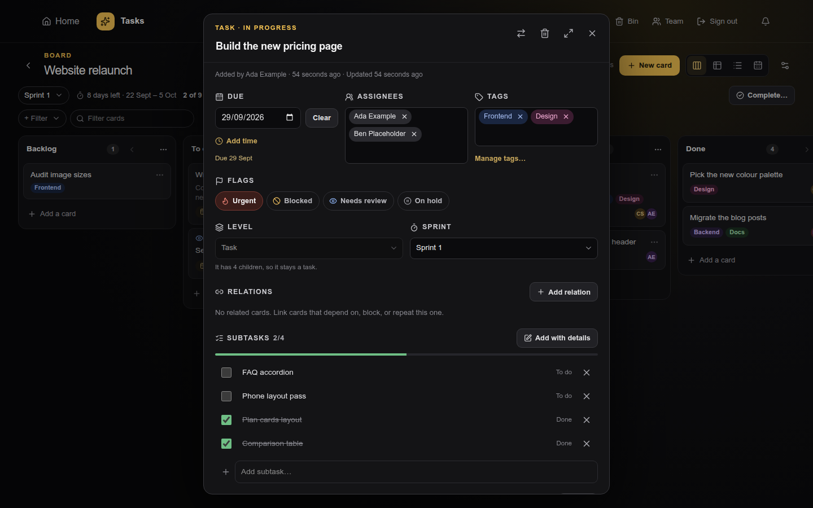
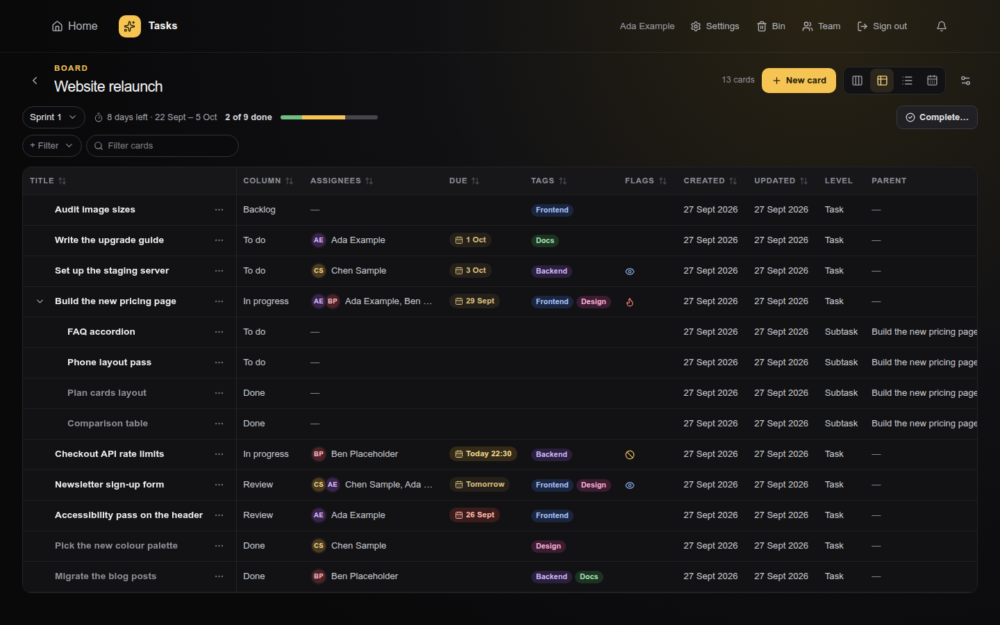
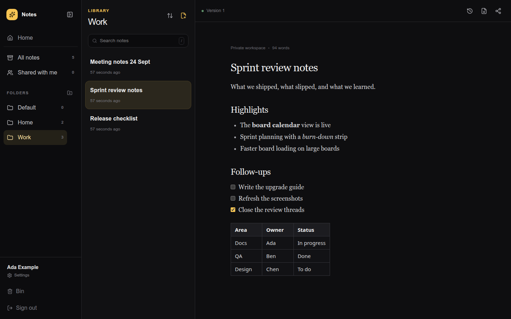
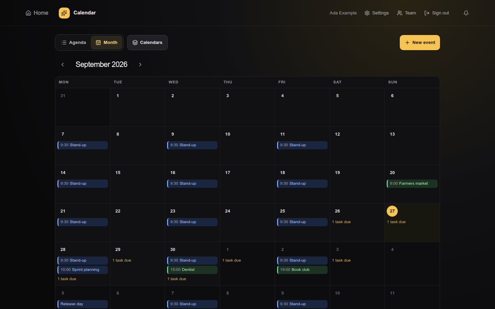

# Nook

**A private, self-hosted workspace for a household or a small trusted team: notes, files, tasks, collections, and calendars in one small Docker container.**

Everything stays on storage you control. Notes are portable Markdown files with immutable version history, files keep their bytes, and nothing is shared until you share it. Built with Bun, Hono, SQLite, React, and Tiptap.

Documentation: [pankajsoni19.github.io/nook](https://pankajsoni19.github.io/nook/)

<p align="center">
  
</p>

## Features

### Today

The home screen shows what needs you now: cards due soon and assigned to you, recent and unpublished notes, drafts written by agents, recent files and collection rows, upcoming events, items leaving the Bin, and your storage use. Sections can be hidden per account.

### Notes

- Markdown editor with slash commands, checklists, code blocks, quotes, pasted or dropped images, and tables.
- Drafts save automatically; **Publish** records an immutable version you can diff and restore.
- **Download as PDF**, folders, and sharing by note or folder.
- Full-text search across titles and bodies: accent- and case-insensitive, prefix and phrase matching, and it never shows what you cannot read.

### Files

- Upload with progress, cancel, and retry; list or thumbnail grid; rename, move, and share in the same folders as notes.
- Inline previews for images, PDFs, text, audio, and video. Types are detected from the file's bytes, and unsafe types (SVG, HTML) are download-only.
- Per-file size limit, per-user quota, and a free-disk floor.

### Tasks

- **Boards** with drag and drop, columns with To do / In progress / Done states, and **WIP limits**.
- **Cards** with due dates and times, multiple assignees, colour **tags**, **flags** (urgent, blocked, needs review, on hold), **relations** (depends on, relates to, duplicates), comments, and attachments.
- A full-screen **card composer** that sets everything in one step, and a full-page card view.
- **Views**: columns, a sortable table, a grouped list, and a calendar with drag-to-reschedule. A filter bar (assignee, tag, flag, due, column, level, sprint, relations) keeps its state in the URL, so filtered views are shareable links.
- **Hierarchy**: Task › Subtask, Epic › Story › Subtask, or your own level names, with subtask checklists, progress, and parent chips.
- **Sprints**: plan, start, and complete sprints, with a sprint switcher, a progress strip, and a carry-over choice for unfinished cards.
- **Templates**: Simple kanban, Personal to-do, Task checklist, Scrum sprint board, Epic › Story › Subtask, Bug triage, and Content pipeline.
- **Tasks home**: **My work** lists everything assigned to you across boards; **saved views** keep a cross-board filter and layout, shared privately, with chosen people, or with everyone, and always evaluated as the viewer.

<p align="center">
  
  
</p>

### Collections

Typed tables for inventories, subscriptions, expenses, recipes, or contacts: text, number, date, checkbox, select, link, note, and file fields; inline editing; sort, filter, and saved views; one-step undo; CSV import and export; and sharing as view-only or can-edit.

### Calendar

Calendars with agenda and month views, repeating events, links to notes, cards, and rows, due cards overlaid on the calendar, and sharing as view-only or can-edit. Reminders arrive in the notification bell and as Web Push on HTTPS, and revocable iCalendar feed links (busy-only or full details) let other calendar apps subscribe.

### Whiteboards

Sketches, diagrams, and floor plans with the Excalidraw editor, saved as `.excalidraw` files in your Files folders. Boards save as you draw (a conflict between two devices never overwrites silently), work offline for a moment, pinch-zoom on phones, export PNG and SVG, and share view-only through the same Access sheet as files. Place pictures from Files (or upload, drop, or paste them; they are stored as files and shown only to people who can open them), link shapes to notes, files, cards, boards, and events, restore earlier versions from History, duplicate boards, import `.excalidraw` files, show a board as a card in a note, and find boards by their text in search. The editor loads only when you open a board and makes no requests outside your Nook.

### Vault

Team secrets per environment (dev, staging, prod, or your own): values, logins, and notes with encrypted comments, a secrets × environments grid on a computer and one environment's cards on a phone, reveal that hides again after 30 seconds, copy that clears the clipboard, a password and token generator in the browser, 20 versions per value, and the Bin. **Encrypted at rest; anyone with the server and its key can read every secret**, so it is for your services' credentials, not a replacement for a personal password manager. Off until `VAULT_ENCRYPTION_KEY` is set; see [docs/OPERATIONS.md](docs/OPERATIONS.md#vault). In this release each vault is its owner's alone; sharing, API keys, and MCP tools come later.

### Team

- Roles: **admin**, **member**, **viewer** (reads what is shared with them or with everyone, changes nothing), and **guest** (reads only what is shared with them by name). Read-only roles are enforced on the server, not just hidden in the app.
- Admins block and unblock accounts, sign them out everywhere, and see activity. Admins never see anyone's private content.
- New accounts get `SIGNUP_ROLE` (default `guest`). A host CLI (`server/team-admin.ts`) recovers from a lockout.
- **Sign in with Google** (optional): `AUTH_METHODS=password|google|both` chooses the methods, enforced on the server. Google accounts are created automatically when registration would allow it (the first account, an invite, or open registration), `GOOGLE_ALLOWED_DOMAINS` limits them to your company domains, two-factor still applies, and Google profile pictures replace the letter avatars (downloaded and served by Nook itself). Setup: [docs/OPERATIONS.md](docs/OPERATIONS.md#google-sign-in).
- **Behind a reverse proxy or Tailscale Serve**, set `TRUSTED_PROXY_HOPS=1` (and `TRUSTED_PROXY_ADDRESSES` to the proxy's own address, so nobody reaching the port directly can choose an address) so rate limits count each visitor separately (see [docs/OPERATIONS.md](docs/OPERATIONS.md#rate-limits-and-reverse-proxies)).
- **Central access**: Team → a member → **Access** shows everything a person can open, per module and through what (direct, a group, or everyone), with titles hidden for items the admin cannot open. Admins can only take access away (remove, lower, leave a group, revoke keys, or **Reset access**), each confirmed, logged in **Team → Access activity**, and announced on the owner's bell. **Team → Templates** gives invites a role and groups. Everyone but guests sees their own in **Settings → My access**.

### Everywhere

- **Shared Bin**: deleted notes, files, cards, boards, collections, rows, calendars, and events wait 30 days with their history and sharing, then are removed for good. A card moves to the Bin with its subtasks. The Bin is in **Settings → Bin** (`/settings/bin`).
- **Settings → Modules**: turn apps on or off for your account on every device. Nothing is deleted and sharing is unchanged.
- **Mobile first**: every app, item, and view has its own URL, phones get focused single-column screens, and browser Back and Forward work everywhere (Back closes an open dialog or sheet first).
- **MCP server**: a Streamable HTTP endpoint for trusted AI clients with revocable API keys and per-key permissions across notes (read, write drafts), files (read), tasks (read, write), collections (read, write), calendar (read, write), Today, and team (admins). Agents write drafts; publishing always stays with you.
- **REST API and scoped keys**: the same tools over plain HTTPS at `/api/v1` for scripts and CI, opt-in per key. A key can be limited to chosen folders, notes, files, boards, saved views, collections, calendars, routines, or whiteboards (lists, search, and Today then show only those), and to IP addresses behind a configured reverse proxy.

<p align="center">
  
  
</p>

## Security

- Argon2id passwords, opaque HttpOnly SameSite session cookies, CSRF tokens, a strict Content Security Policy, and an exact browser-origin allowlist.
- Optional or required TOTP two-factor authentication; secrets and recovery codes are encrypted with AES-256-GCM.
- Private by default: the server authorises every read, and search, previews, Today, feeds, and MCP only see what the user may open.
- Hashed API keys and feed tokens, rate limits on sign-in, search, and MCP, and payload-less Web Push to allowlisted push services only.
- A hardened container: non-root user, read-only root filesystem, dropped capabilities, and `no-new-privileges`.
- Verified weekly backups with five-archive retention (`scripts/backup.sh`).

Nook is designed for one host on a trusted network. Prefer HTTPS through Tailscale Serve or a reverse proxy.

## Quick start

You need Git, Docker Engine, and Docker Compose.

```sh
git clone https://github.com/pankajsoni19/nook.git && cd nook
cp .env.example .env            # set ALLOWED_EMAILS, TOTP_POLICY, APP_ORIGINS as needed
sudo mkdir -p /srv/mynotes && sudo chown 1000:1000 /srv/mynotes   # or set MYNOTES_DATA_DIR
APP_VERSION=0.26.0 GIT_SHA=$(git rev-parse --short HEAD) docker compose up -d --build
curl http://localhost:2026/api/health   # then open http://localhost:2026 and create the first account (the admin)
```

Later registrations stay disabled unless you set `ALLOW_REGISTRATION=true`. `APP_NAME=Acme Notes` renames the app in titles, link previews, the installed app, and mail. Every environment variable (email, push, limits) is listed in [docs/OPERATIONS.md](docs/OPERATIONS.md#configuration). Internal identifiers such as `mynotes.sqlite`, the `mynotes` container, `MYNOTES_DATA_DIR`, and the `mynotes-*` backup archives keep the original prefix for compatibility.

## Upgrading

Back up first (`./scripts/backup.sh --force`), pull, rebuild, and let migrations run on the first boot. Release-specific steps are in [docs/OPERATIONS.md](docs/OPERATIONS.md#upgrades).

## What's new in v0.26.0

- **Chat (first slice)**: chat with your own agents through any OpenAI-compatible model provider. An admin adds a provider in **Settings → AI** (base URL, API key, default model; the key is stored encrypted and never shown again, only its last characters) and sets who may chat and daily token budgets. Anyone allowed creates agents in **Settings → Agents** (a system prompt, an optional model, and a step limit) and chats with them in the new **Chat** app: replies stream in as they are written, **Stop** keeps what arrived, **Regenerate** and **Edit** keep every version with a 2 / 3 switcher, chats are searchable, pinnable, renamable, and go to the Bin. Two columns on a computer; list and chat screens with working Back on a phone.
- **Safe rendering**: replies are Markdown (tables, code with Copy, lists) built without HTML strings; images are never loaded, and outside links open through a sheet that shows the full address.
- **The first outbound connection Nook makes**: only to the providers an admin configures, https only (plain http only for hosts listed in `AGENT_ALLOWED_PRIVATE_HOSTS`), private and loopback addresses refused unless listed, no redirects, size and time limits, the address pinned between the check and the connection, and no cookies or Nook headers sent.
- **Private in this release**: agents and chats are their owner's alone; tools, the external API and Audit log, sharing, and knowledge bases follow in the next releases.
- **For developers using MCP**: `list_agents`, `list_chats`, and `get_chat` for keys with the new `agents:read` permission (your own agents and chats only).
- **New settings**: `AGENT_SECRETS_KEY` (or `AGENT_SECRETS_KEY_FILE`; Chat is off without it), `AGENT_ALLOWED_PRIVATE_HOSTS`, `AGENT_MAX_CONCURRENT_RUNS`, `AGENT_RUN_TIMEOUT_S`. `bun server/agent-admin.ts verify-key | rotate-key` checks and rotates the key.
- Migration 039 runs on the first boot, so back up first: it adds the Chat tables and rebuilds the API key grants table once so keys can be granted Chat (and, later, Messages) permissions; every existing key and grant is kept exactly. See [docs/OPERATIONS.md](docs/OPERATIONS.md#upgrades).

## What's new in v0.25.0

- **Your own app name**: set `APP_NAME` (for example `APP_NAME=Acme Notes`) and the name appears in every tab title, in link previews when you share a URL, in the installed app's name, in email subjects and the sender name, in the two-factor issuer, and across the app's own screens. Leave it unset to keep "Nook". Internal ids and key prefixes never change.
- **Bin inside Settings**: the Bin is a Settings section now (Workspace → Bin, with its item count). Old `/bin` links still open it. Guests, who can delete nothing, don't see it.
- **A slimmer top bar**: Settings · Inbox · bell · your name · Sign out. The Bin and Team buttons are gone (both live in Settings); admins see the blocked-account count on Settings → Team → Members instead.
- **Fixes**: browser Forward onto a hidden entry after turning a module off no longer leaves the address and the screen out of step (the app's history listener was being re-registered on every render); the Bin is fetched once when opened.
- No migration. `APP_NAME` is the only new setting. See [docs/OPERATIONS.md](docs/OPERATIONS.md#upgrades).

## What's new in v0.24.0

- **Vault API keys (`nkv_`)**: a separate kind of API key for scripts, CI, and AI clients that reach only the Vault. Create one in Settings → API keys with **Kind: Vault key**, choosing vaults and environments you can reach yourself, at read or write. A vault key never reaches other modules, and a general key never reaches the Vault, at the API and in the database. Its rights are always your rights at that moment: lose access, and the key loses it too; blocked, and the key stops.
- **Protected environments over keys**: "every environment" never includes a protected one. A key reaches a protected environment only when the grant names it and the key was created with **Allow protected environments** (your password and code at creation stand in for the re-auth window). Protect an environment later and every key that did not name it loses it.
- **REST**: `GET /api/v1/vault/vaults`, secrets, values (`GET`/`PUT` with `expectedVersion`), and version metadata, Bearer only, JSON only, `no-store`. **MCP**: vault keys see only the vault tools (`list_vaults`, `read_vault`, `list_secrets`, `read_secret`, `write_secret_value`, `create_secret`); values go to an MCP client only when the key has **Allow MCP clients to read values** on, and the dialog suggests MCP-only surfaces for such keys.
- **Limits and alerts**: per key, 20 reads a minute and 1,000 an hour, 10 writes a minute and 200 a day, 60 values an hour over MCP, never charged to you. A key that hits a limit, or reads more than 500 values in a day, shows in your bell and in the vault's Activity, once a day.
- **Where keys show**: the vault's Access page lists **Keys with access** (owners see each key; other members see the count and their own), Activity shows `key:<name>` actors with an "API keys" filter, and Team → Keys has a Kind filter that shows vault keys as counts only, never vault names. Members who don't manage access get a read-only Access page.
- **Independent review**: the whole Vault (v0.20.0–v0.24.0) had an independent security review before this release; no HIGH finding, and every MEDIUM was fixed.
- Migration 038 runs on the first boot, so back up first: it only adds (a protected-access flag on keys, a per-environment protected mark on grants, key names on vault events, an index, and triggers that keep vault grants on vault keys). See [docs/OPERATIONS.md](docs/OPERATIONS.md#upgrades).

## What's new in v0.23.0

- **Settings is a full page**: a left nav with an Account group (Security, Notifications, My access, API keys, Modules, About) and a Team group (Members, Invites, Groups, Integrations, Keys, Policies, Templates, Access activity, Email log), each section filling the rest of the screen and scrolling on its own. Team lives inside Settings now; the old `/team/...` links still work and open the same screens. On a phone, Settings opens as a list; a section opens on its own screen with a back arrow, and browser Back returns to the list, then to where you were.
- **Top bar order**: Bin · Team · Settings · Inbox · bell · your name · Sign out, with Sign out as the rightmost action on every screen.
- **Leaving with a new key on screen** asks first everywhere: switching section, the back arrow, Home, Bin, Inbox, the bell, Sign out, and browser Back or Forward.
- No migration and no new settings. See [docs/OPERATIONS.md](docs/OPERATIONS.md#upgrades).

## What's new in v0.22.0

- **Shared vaults**: a vault's owner shares it with people and groups per environment at none, read, write, or admin (viewers read at most; guests and integrations never). The Access page is a people × environments grid on a computer and cards on a phone, with a leave guard for unsaved changes. Owners can hand a vault over in one save, and a vault always keeps one owner. Admins who are not members still see nothing: not the name, not the activity.
- **Protected environments**: `prod` is protected by default. Revealing, editing, exporting, or reading the history of a protected environment asks for your password (and code) again, once per 15 minutes per session; a stolen session cookie cannot read it.
- **Import and export**: `.env`, JSON, and CSV, with a preview of what will be created, updated, or skipped; exports are limited to ten an hour, recorded in Activity, and CSV cells that look like formulas are neutralised.
- **Data-key rotation**: whenever anyone loses read on an environment (removed from the vault, from a group, blocked, or demoted to guest), the vault's data key is rotated in the background and the owners get a bell notice to rotate the real credentials upstream, with "Show what they read". Rotate on demand from the vault's settings.
- **Activity and history**: an Activity page per vault (who did what, counts, never values), a version-history dialog with Show and Restore, a tag filter, "Shared with me" on the vault list, and a 64 MiB storage quota per vault creator.
- **For developers using MCP**: still no vault tools; `nkv_` keys, REST, and MCP tools come in the next release.
- Migration 037 runs on the first boot, so back up first: it only adds (a re-auth timestamp on sessions, the vault's stored bytes, two columns on vault events, and a trigger that keeps integrations out of vaults). See [docs/OPERATIONS.md](docs/OPERATIONS.md#upgrades).

## What's new in v0.21.0

- **Connected whiteboards**: pictures from Files on the canvas (insert from your files, upload, or drop; a shared board never shares its pictures, so viewers need the file shared too), links from any shape to a note, card, row, file, or board (or an outside link, opened only after a confirm), a **whiteboard card in a note** (type `/whiteboard`; readers without access to the board see only "Whiteboard unavailable", and the note's Markdown never carries the board's name), **History** with previews and Restore (editing is blocked while a restore runs; nothing drawn meanwhile is lost), **Duplicate**, **Import** of `.excalidraw` files (pictures embedded in the file become Files in the board's folder), SVG export, and whiteboards in the search screen.
- **Never unsavable**: if a picture's file is unshared or deleted, the board takes it off with a message and saves; the half-hourly snapshot is skipped rather than refusing a save when storage is full; a restored version drops pictures you can no longer open.
- **Phones**: tapping a shape's link icon works for outside links too; History, pickers, and confirms close with Back.
- **For developers using MCP**: no new tools; `read_whiteboard` now returns picture references as document ids.
- No migration in this release. See [docs/OPERATIONS.md](docs/OPERATIONS.md#upgrades).

## What's new in v0.20.0

- **Vault (first release)**: a new app for your services' secrets, with environments (dev, staging, prod, or your own). Each secret holds one value per environment, with an encrypted comment, twenty kept versions, and the Bin. On a computer it is a secrets × environments grid; on a phone, one environment's cards, picked with the app's own selector and kept in the URL. Values stay masked until you press **Reveal** and hide again after 30 seconds, when the tab is hidden, or when the dialog closes; **Copy** clears the clipboard after 30 seconds unless you copied something else since. The editor masks the value too, with a Show toggle. A generator makes passwords, hex and base64url tokens, and six-word passphrases in the browser. Saving into several environments at once checks every environment's version, so nobody's newer value is overwritten silently.
- **Honest labelling**: **encrypted at rest; anyone with the server and its key can read every secret.** The Vault is for your services' credentials, not a replacement for a personal password manager. Values and comments are encrypted with AES-256-GCM under a per-vault data key wrapped by `VAULT_ENCRYPTION_KEY`; names and tags are plain so you can search them.
- **Off until you set a key**: set `VAULT_ENCRYPTION_KEY` (`openssl rand -base64 32`, different from `TOTP_ENCRYPTION_KEY`) or `VAULT_ENCRYPTION_KEY_FILE` (a file outside the data directory, so backups never contain it). Without it, members see nothing and admins see a "not configured" screen. `bun server/vault-admin.ts verify-key` checks the key; `rotate-kek` re-wraps the data keys under a new key read from a file, refuses while a server is running, and prints fingerprints, never the key. See [docs/OPERATIONS.md](docs/OPERATIONS.md#vault).
- **In this release each vault is its owner's alone**: another member, a viewer, a guest, or an admin who does not own it gets "not found" everywhere. Sharing with people per environment, import and export, `nkv_` API keys, and MCP tools come in the next two releases.
- **Also**: SQLite now runs with `secure_delete` on for every module, so deleted rows are overwritten instead of lingering; the server writes a `server.heartbeat` file in the data directory while it runs.
- **For developers using MCP**: no new tools; no key can reach the Vault yet.
- Migration 031 runs on the first boot, so back up first. It only adds tables; its number is lower than 032–036, which your instance already applied (expected: each migration runs by its own number). See [docs/OPERATIONS.md](docs/OPERATIONS.md#upgrades).

## What's new in v0.19.0

- **Integrations (service accounts)**: admins can set up accounts for AI clients and scripts that act as themselves rather than as a person: a CI job that posts results, a bot that files cards, an agent that reads a shared folder. **Team → Integrations** creates one with a name and a role (member or viewer), and admins create, rotate, narrow, and revoke its API keys there, with their own password. An integration **never signs in**: every sign-in path (password, reset, invite, Google) refuses it, and it gets no email or bell notifications.
- **Reach only what is shared with it by name**: an integration is never part of "everyone signed in" and cannot join a group, so its keys reach only the notes, files, boards, collections, calendars, and whiteboards owners share with it explicitly from the Access sheet, where it appears under **Integrations** with a robot icon and an **Integration** badge. Because admins hold its keys, the sheet says so: *Admins hold its keys and can read what you share with it.* Admins still never read anything that was not shared with the integration.
- **Attribution**: cards, comments, note versions, and whiteboards created through an integration's key show its name with the badge. Team → Keys lists the keys with the integration as owner. `GET /api/v1/me` reports `owner.kind: "service"` for such keys.
- **Blocking and deleting**: block pauses its keys at once; delete revokes them and removes the account when it never had a key and created nothing, otherwise keeps it as **Deleted (kept for attribution)**, which can never be unblocked or re-keyed.
- **Leaving with a new key on screen** now asks first on the integration's page too, including browser Back on phones.
- **For developers using MCP**: no new tools; there are no tools that create or manage integrations or their keys.
- Migration 036 runs on the first boot, so back up first. It only adds (a description and a retired marker on accounts, and database triggers that keep integrations out of sessions and Google sign-in). Nothing about existing people or keys changes. See [docs/OPERATIONS.md](docs/OPERATIONS.md#upgrades).

## What's new in v0.18.0

- **Keys limited to chosen items in every module**: an API key can now be limited to chosen folders and notes, folders and files, boards and saved views (only views you own, read only), collections, calendars, routines, and whiteboards. Every tool checks each item it touches: anything outside the key's choice answers "not found" as if it did not exist, and lists, search, Today, and counts include only the chosen items.
- **A REST API for keys**: scripts and CI jobs can call the same tools as MCP over plain HTTPS: `GET /api/v1/me` (what the key can do), `GET /api/v1/tools` (the tools it may call, with their input schemas), and `POST /api/v1/tools/<name>` with a JSON body of the tool's arguments. The tools, arguments, results, limits, and rules are the same as over MCP. Send the key only as `Authorization: Bearer <key>`; a key in a URL is refused. Every error has a stable `code` (`AUTH_REQUIRED`, `KEY_INVALID`, `KEY_POLICY`, `IP_NOT_ALLOWED`, `KEY_IN_URL`, `NOT_FOUND`, `RATE_LIMITED`, and for file uploads `UPLOAD_NOT_FOUND`, `UPLOAD_CONFLICT`, and `UPLOAD_FAILED`; see [docs/USING.md](docs/USING.md#the-rest-api)). For example:

  ```sh
  curl -s -X POST "https://<your nook>/api/v1/tools/list_boards" \
    -H "Authorization: Bearer <YOUR_API_KEY>" -H "Content-Type: application/json" -d '{}'
  ```
- **Where a key is used**: each key says whether it works over MCP (the default), REST, or both. Editing a key can only narrow this, without a password; to widen it, rotate the key or create a new one. Per-minute limits and "last used" are kept for each surface, so a busy script does not slow your AI client down. Admins decide which team roles may use REST and MCP in **Team → Policies** (REST: admins and members by default).
- **Address limits for keys**: a key can be limited to up to ten IPv4 or IPv6 addresses or ranges. This is offered only when the server sits behind a reverse proxy it trusts (`TRUSTED_PROXY_HOPS` of 1 or more). A refused call shows on the owner's key row ("Last refused …") and in its **Recent activity** section, with a shortened address; admins see it in Team → Access activity, without the address.
- **Rotating can change access**: because rotating asks for your password, it can now also change the new key's access, where it is used, and its allowed addresses, including widening them. **Edit** still only narrows, for example from all boards to chosen ones.
- **New optional setting `TRUSTED_PROXY_ADDRESSES`**: the addresses or ranges your reverse proxy connects from. When set, forwarding headers are read only from those proxies. Set it as soon as `TRUSTED_PROXY_HOPS` is 1 or more; otherwise Nook logs a warning at startup and the app port must be reachable only through the proxy (for example `"127.0.0.1:2026:2026"` in `compose.yaml`).
- **Small fixes**: on a computer the Team pages and the Inbox scroll the list and the details separately; the Home header stays in place while Today scrolls; member pages no longer log a console error while Google sign-in is off; Back after deleting a note or file from its list no longer takes an extra step; the **Publish version** button is larger on phones; End, Home, PageDown, and PageUp scroll the Files list and long notes; an open Access sheet stops offering guests once sharing with guests is turned off; and Access activity lines read as sentences.
- **For developers using MCP**: there are no new tools, and no tool on either surface deletes forever, shares, or manages keys. Invalid arguments now name the argument on every tool (`"cardId: Invalid UUID"`), the `Bearer` scheme is accepted in any letter case, and every key that does not authenticate (mistyped, expired, rotated, or revoked) answers the one code `KEY_INVALID`; the reason is shown only to the key's owner.
- **Not in this release**: service accounts.
- Migration 033 runs on the first boot, so back up first. Existing keys are unchanged: they stay MCP-only with no address limit, and REST is off on new keys until chosen. See [docs/OPERATIONS.md](docs/OPERATIONS.md#upgrades).

## What's new in v0.17.0

- **Whiteboards**: a new app for sketches, diagrams, and floor plans, built on the Excalidraw editor: shapes, arrows, lines, freehand drawing, text, colours, undo and redo, and Mermaid diagrams turned into shapes. The editor ships inside Nook and runs entirely from your own server: it makes no requests to other sites, its fonts are included, and the content security policy is unchanged. A browser downloads it only when someone opens a board.
- **Boards live in Files**: each board is a `.excalidraw` file in one of your folders and appears in the Files list with its own icon. You can rename it, move it to another folder, download the `.excalidraw` file, export a PNG, or delete it to the Bin and restore it from there. Boards count toward your storage.
- **Saving**: changes save by themselves, at the latest every 5 seconds while you keep drawing. When the connection drops, a copy of your unsaved work is kept on the device and sent when the connection returns, even if you do not reopen the board. Leaving the page right after drawing keeps the change.
- **Two devices**: if a board changed on another device, Nook asks whether to **Reload latest** or **Save mine as a copy**; nothing is overwritten silently.
- **Safety net**: when a save empties a board, or leaves a board of 10 or more shapes with fewer than half of them, the version before is kept (the newest five per board), and the owner can bring it back with **Restore previous version**.
- **Sharing**: share a board with people and groups through the Access sheet. Only the owner edits; everyone else gets a view-only canvas with a banner naming the owner.
- **Search**: board names and the text on boards are indexed. For now you can search them through the web API and the MCP tool `list_whiteboards`; the Search screen in the app does not show whiteboards yet.
- **Around the app**: Settings → Modules has a Whiteboards row (on by default), Today lists recent whiteboards, and on phones pinching zooms the canvas, not the page.
- **API keys and MCP**: two new key permissions, **Read whiteboards** and **Create whiteboards**, and a key can be limited to chosen boards. New MCP tools `list_whiteboards`, `read_whiteboard`, and `create_whiteboard`; no tool edits, deletes, or shares a board. Existing keys gain nothing.
- **Not in this release**: images on the canvas, links from shapes to Nook items, embedding a board in a note, a full version history, importing `.excalidraw` files as boards, SVG export, and a whiteboards filter in the Search screen.
- Migration 030 runs on the first boot, so back up first. The Docker image grows by about 26 MB. No new settings; if you ever changed the key modules in **Team → Policies**, tick Whiteboards there before keys can use it. See [docs/OPERATIONS.md](docs/OPERATIONS.md#upgrades).

## What's new in v0.16.0

- **Long pages scroll again (fix)**: Team pages (members, Policies, Keys, Access activity, Groups, Templates, Invites, a member's Access page, the email log), the Bin, Inbox, Routines, Notifications, the Calendar month on a computer, the Files list and grid on phones, and the sign-in pages on a phone held sideways could not be scrolled with the mouse wheel, touch, or the keyboard, so controls below the first screen (for example **Save policies**) could only be reached with the Tab key. They all scroll now.
- **Faster loading**: the app's files are now cached by the browser and sent compressed. Files whose names change with each release are kept for a year; the app page, the service worker, and the manifest are checked on every load, so a new release is picked up at once. In our measurement, loading Home the first time dropped from about 1.9 MB to about 0.42 MB, and a reload from about 1.9 MB to under 1 KB. Nothing to configure.
- **No more browser pop-ups**: every confirmation (an API key you have not saved yet, discarding a draft, **Delete forever** and **Empty Bin**, leaving Files during an upload, turning off two-factor, new recovery codes) uses Nook's own dialog, which fits on phones and closes with the Back button. Leaving Files with the browser's Back button during an upload now asks first.
- **API keys**: creating or rotating a key offers **No expiry**, unless the team policy requires an expiry, in which case the choice is disabled and says why. While that policy is on, a key without an expiry is blocked (not revoked), and its row says "Rotate it to give it one." The API keys page is now **Settings → API keys** at `/settings/keys`; old `/settings/mcp` links still open it.
- **Notes**: **Move to folder…** moves the open note, on a computer (toolbar) and on a phone (the ⋯ menu).
- **Today**: Today asks once whether you want the morning email digest (**Every morning**, **Mondays only**, or **No thanks**). It appears only when email is on, your address is verified, your account is at least a week old, the digest is off, and you have not answered before.
- **Calendar and Files**: a muted calendar says **Muted** in words, not only with an icon; the Calendar header has a **Bin** button like the other apps; the Files list/grid toggle is larger on phones.
- **Access**: after sharing with a guest is refused, the Access sheet marks the guest rows that were kept right away; notices and invites word deleted groups and invite templates more clearly; the key filter in **Team → Access activity** shows the owner of keys that are no longer live.
- **Smaller fixes**: Back no longer repeats a step after you delete the note or file you were viewing; lists of boards, collections, and calendars need fewer database queries; a request for a missing file with an extension (such as `/favicon.ico`) now answers 404 instead of the app page; `/robots.txt` asks search engines not to index Nook; and if the app fails to load, a short message suggests reloading instead of an empty page.
- Migration 035 runs on the first boot, so back up first. No new settings and no new MCP tools; see [docs/OPERATIONS.md](docs/OPERATIONS.md#upgrades).

## What's new in v0.15.0

- **Sign in with Google**: the sign-in, register, and invite pages offer **Continue with Google**. A Google address with no account gets one automatically when registration would allow it: open registration, a valid invite, or the first account on an empty instance (which becomes the admin). Accounts with two-factor on still enter their Nook code after Google. `ALLOWED_EMAILS` and blocking apply as for passwords.
- **Sign-in methods**: `AUTH_METHODS` is `password` (the default), `google`, or `both`, enforced on the server. `password` turns Google sign-in off; `google` turns off password sign-in, registration with a password, forgot and reset password, and password change. Upgrading changes nothing until you set it.
- **New settings**: `AUTH_METHODS` (default `password`), `GOOGLE_CLIENT_ID` and `GOOGLE_CLIENT_SECRET` (empty; both required for `google` or `both`, or the server refuses to start), `GOOGLE_ALLOWED_DOMAINS` (empty; optional list of email domains allowed to use Google sign-in; it does not restrict password registration), and `TRUSTED_PROXY_HOPS` (0 to 5, default `0`; the number of reverse proxies in front of Nook).
- **Profile pictures**: a Google user's picture replaces the letter in the header, Settings, Team, the Access sheet, card assignees and the assignee picker, and comment authors. The server downloads it at sign-in and serves it from your Nook, so browsers never contact Google and the content security policy is unchanged. Without a picture, or if it fails to load, the letter is shown. Pictures are stored in the data directory (`avatars/`) and included in backups.
- **Linking existing accounts**: a Google sign-in links automatically only to an account whose address Nook has verified, and only when Google is authoritative for that address (a Gmail address, or a Google Workspace account on the address's own domain). Otherwise nothing about the account changes and the person is told what to do. Password users link in **Settings → Security → Link Google** after confirming their password. An admin can allow a link from **Team** (once, within 24 hours), optionally resetting the account first, and can allow re-linking when someone recreated their Google account. The host command line does the same: `allow-google-link <email> [--reset | --keep-credentials]` and `unlink-google <email>`.
- **New admin powers**: **Allow Google sign-in**; **Reset account for Google sign-in** (signs the account out everywhere, revokes its API keys and calendar feed links, removes its password and two-factor, makes everything it owns private and removes its shares, revokes its open invites, and pauses its routines; content is kept), offered in the app only for accounts whose address was never verified and never for admins or accounts that were admins in the last 24 hours; **Allow re-linking** (when the new Google account signs in, the previous holder's sessions, API keys, calendar feed links, and unused password-reset links end, and by default the password and two-factor too); and **Unlink** (the member is signed out everywhere). Each asks for your own password (or a Google confirmation) and two-factor code, is recorded in **Team → Access activity**, and tells the member on the bell and, with email on, by security mail; a reset is also shown at their next sign-in.
- **Accounts without a password**: people who sign in only with Google are asked to **Confirm with Google** where others give their password (new API key, rotate, two-factor setup); it needs a fresh Google sign-in.
- **Rate limits**: password sign-in, account creation, and invite preview are now also limited per client address (20, 5, and 10 a minute), in addition to the per-email and instance-wide limits. Behind a reverse proxy set `TRUSTED_PROXY_HOPS` so each visitor counts alone.
- **Fixes**: after turning on two-factor, Settings now stays open on the recovery codes (**Copy all**, **Download**, **I saved them**); before, they disappeared at once. No new MCP tools for sign-in or Google accounts, and API keys are unaffected.
- Migration 034 runs on the first boot, so back up first. Nothing changes for sign-in until you set `AUTH_METHODS`; see [docs/OPERATIONS.md](docs/OPERATIONS.md#upgrades) for the Google Cloud setup and reverse-proxy advice.

## What's new in v0.14.0

- **Member access**: admins open **Team → a member → Access** to see everything that person can reach, per kind, one row per item with each way they reach it (shared directly or through a group), plus how many items are shared with everyone signed in, their groups, and their API keys. Items the admin cannot open are shown without their title, as "Board owned by" and the owner's name.
- **Reduce only**: from that page admins can lower a level, remove a direct share, or take the person out of a group. Each change asks for confirmation, is recorded, and tells the item's owner or the person on the bell. Nothing on the page grants or raises access.
- **Reset access**: removes a person's direct shares and group memberships, revokes their API keys and calendar feeds, and pauses their routines, with counts shown before and after. Items the person owns are untouched. It is not offered on your own account.
- **My access**: **Settings → My access** (`/settings/access`) shows, read-only, what you can reach and through what. Guests do not have it.
- **Access templates**: **Team → Templates** holds a role and groups. Pick one on an invite and the new account joins those groups when it registers. An invite keeps the template as it was when the invite was made, so later edits do not change invites already sent; deleting a template leaves its invites working with their role and no groups. Applying a template to an existing member adds its groups and never changes their role. With sharing with guests off, a guest skips groups that have items shared with them.
- **Access activity**: **Team → Access activity** shows who changed whose access, filtered by person, group, key, and kind of change.
- **Bell**: the bell now tells you when you are added to or removed from a group, when an admin lowers, removes, or resets access (to your items, or yours), and when an admin revokes your API key. The Access sheet tells an owner how many of their API keys can reach the item.
- **Fixes**: the New group dialog focuses the name and checks it inline; wording fixes. No new MCP tools, and API keys cannot manage access.
- Migration 032 runs on the first boot, so back up first. Admins gain new powers to see and reduce access; see [docs/OPERATIONS.md](docs/OPERATIONS.md#upgrades).

## What's new in v0.13.0

- **Passwords**: change your password in **Settings → Security** with your current password, plus a two-factor code when you use one; your other devices are signed out. With email on, **Forgot password?** on the sign-in page mails a single-use link that works for 30 minutes, and a security email says when a password was changed or reset. With email off there is no self-service reset and the links are hidden. Settings also says when two-factor cannot be set up because this Nook has no TOTP key.
- **Groups**: admins create groups in **Team → Groups** (`/team/groups`) and decide who is in them; owners share items with a group, and its members follow as people join or leave.
- **Levels**: each person or group gets a level: **Can view**, **Can comment** (boards), **Can edit**, or **Manager** (boards, collections, and calendars). People who can edit a note write its draft and publish it. Files and task views stay view-only for other people.
- **One Access sheet**: the **Share** button on notes, folders, files, boards, task views, collections, and calendars opens the same Access sheet. It warns before a change of audience drops people, and asks before discarding unsaved changes.
- **Sharing with guests**: **Team → Policies** has a switch for sharing with guests. While it is off, new shares that would reach a guest are refused, whether directly, through a group, by adding a guest to a group that already has shares, or by changing such a member to the guest role. What is already shared stays until its owner changes it, and can be lowered or removed but not raised.
- **Fixes**: viewers, commenters, and guests no longer see card actions they cannot use. On a page loaded directly, Back closes an open dialog at every width; dropdowns and pickers are their own Back step; Board settings and the Calendars sheet stay open under the dialogs they open. New Notes folders and links use the app's own name dialog instead of browser prompts. A routine's "due" state now follows the same clock as its next run time.
- **API keys**: structure tools on boards (rename and recolour tags, WIP limits, create and start sprints) work through a key only for the board's owner; a manager's key is refused. Creating a board tag now needs the edit level. No new MCP tools.
- Migration 029 runs on the first boot, so back up first. Some owner powers move to managers; see [docs/OPERATIONS.md](docs/OPERATIONS.md#upgrades).

## What's new in v0.12.0

- **API keys**: Settings → API keys replaces Settings → MCP. Build a key one permission at a time (module, permission, and all or chosen boards, collections, or calendars) with an expiry within your team's policy. The token is shown once. Edits only narrow a key (rename, remove permissions, lower Write to Read, choose fewer items, bring the expiry closer); **Rotate** issues a new secret and lets the old one stop now or keep working for 1 hour, 24 hours, or 7 days. Each key shows its 14-day usage. A key limited to chosen items sees nothing outside them, including through relations, event links, and collection note fields. Existing MCP keys keep exactly the reach they had.
- **Team keys and policies**: **Team → Keys** (`/team/keys`) lists every live key for admins, never its secret, with **Revoke** and a reason the owner sees. **Team → Policies** (`/team/policies`) sets the longest and default key lifetime, keys per person, and which surfaces and modules each role's keys may use, with a preview of how many keys a change would block.
- **Email digests, reminders, and mutes**: a daily or weekly digest at your local time; calendar reminders by notification, email, or both; an email when an event you set a reminder on is changed or cancelled; optional sprint started and completed and Bin clean-up emails (off by default); and **Mute emails** per board or calendar, listed under **Muted** in Settings → Notifications → Email.
- **Bounces and complaints**: an optional Resend webhook (`RESEND_WEBHOOK_SECRET`) stops mail to addresses that bounce or report spam, with **Try again** once a day in Settings, and **Team → Email log** tags recipients whose mail is held back.
- **Fixes**: focus returns to the opener when Calendar and API keys dialogs close, phone Forward reopens a sheet that Back closed with no dead history step, deleting a note confirms in the app's own dialog, the header Bin badge refreshes after a restore or delete, reminder rows say how each reminder is sent, and mail subjects stay within their length cap after defanging.
- Migrations 025 and 028 run on the first boot, so back up first. See [docs/OPERATIONS.md](docs/OPERATIONS.md#upgrades).

## What's new in v0.11.0

- **MCP write coverage**: three new opt-in scopes. `notes:publish` lets an agent publish a note draft it has read, `files:write` lets it upload files, store text files, create folders, and rename or move files, and `bin:write` lets it move items to the Bin and restore them (never forever). Existing keys gain nothing. Settings → MCP has a **Review** dialog per key listing what it binned, with **Restore all** for that key.
- **Routines and runs**: scheduled routines, at `/inbox/routines`, that your MCP agents run on a cadence. Each run is listed in its history with the proposals it made; pause and resume a routine at any time. Routine proposals reach the Inbox and, when email is on, your email.
- **Outbound email**: Resend via `RESEND_API_KEY` and `MAIL_FROM`, off unless both are set. Verified addresses, per-user email settings in Settings → Notifications → Email, one-click unsubscribe pages, and **Team → Email log** for admins. Templates cover invites, security notices, assignments, comments, shares, and proposals. Links in mail point only to `APP_ORIGIN`.
- **Fixes**: steadier ordering for rows created in the same millisecond, React 19 handler bugs, History and Back layering for dialogs and sheets, the phone Settings tab strip scrolls to the active section, 44 px phone targets, new cards go into the active sprint when none is given, note-draft proposals are compared with the draft the agent built on, a resumed routine does not re-run a slot that already ran, MCP `create_sprint` dates sprints by default, and an open note refreshes when its draft is published from the Inbox.
- Migration 026 runs on the first boot, so back up first. See [docs/OPERATIONS.md](docs/OPERATIONS.md#upgrades).

## What's new in v0.10.0

- **Team invites**: admins create single-use invite links at `/team/invites`, optionally bound to one email address, with a fixed role. When email is configured, Nook sends the invite by email.
- **Outbound email** through Resend, off unless `RESEND_API_KEY` and `MAIL_FROM` are both set.
- **Emoji reactions** on card comments.
- **Agent inbox**: MCP keys with `inbox:read`/`inbox:write` propose changes instead of making them; you approve or reject each one in the app only, with a diff. Bulk approve, **Proposals awaiting you** on Today, an Inbox button with a badge, and opt-in push.
- **Review fixes**: rejecting a draft proposal restores your own draft; proposals from a revoked key are superseded; expiry is enforced on approve.
- **QA fixes**: the Settings → MCP checkbox no longer crashes, an app-wide error card replaces a blank page, phones show the page name, a chip marks stale proposals, and bulk approve names the proposals that failed.
- Migrations 018, 021, 022, and 027 run on the first boot, so back up first. See [docs/OPERATIONS.md](docs/OPERATIONS.md#upgrades).

## What's new in v0.9.3

- **The task card opens as a drawer on desktop**: a full-height panel on the right, with the fields column on the left, the description and comments on the right, and the comment box pinned at the bottom. Phones are unchanged.
- **The card composer stays a centred dialog**, so creating a card works as before. No migration in this release.

## What's new in v0.9.2

- **Today** is grouped into **Today**, **Recent work**, and **Housekeeping**, and empty sections fold away.
- **Tags** get distinct colours, and creating one is easy to find: the list opens on focus, with a **Create** row and **+ New tag**.
- **Due** is a picker with **Apply** and **Cancel** and quick picks; lane cards are tidier, and the card dialog is wider, with two columns on large screens.
- **Subtasks always belong to a task**: the parent field offers **Choose a task…**, and **Make it a task** turns a subtask into a task.
- **Sprint defaults per board** (duration, start rule, name pattern), **New sprint** from the header switcher, a dedicated **Sprints** page, and a prompt when no sprint is active.
- **Team** role changes and blocking no longer ask for your password; the session, CSRF check, and audit log still apply. Long dropdown lists scroll again. No migration in this release.

## What's new in v0.9.1

- **Card descriptions size to their text** in the card dialog and the full-page card, growing as you type and scrolling past 60% of the screen.
- **Calendar month**: click an empty part of a day (or its **+**) to add an event on it; on a phone, tap the day, then **New event on <date>**.
- **Copy link** on cards (the card header and a board card's ⋯ **More actions**), without the view or filters, plus even spacing on the Tasks home. No migration in this release.

## What's new in v0.9.0

- **Viewer and guest roles** with read-only enforcement on the server; `SIGNUP_ROLE` (default `guest`) sets the role of new accounts.
- **Task hierarchy and sprints**: subtasks, epics and stories, hierarchy templates, sprint planning, and a lighter board payload.
- **Tasks home** with My work and saved cross-board views. Migration 019 runs on the first boot, so back up first.
- **Review and QA fixes**: read-only roles can edit only their private views (with a Make private option for shared ones), Columns view says how many epics it hides with a Show all levels switch, focus moves into sheets and dialogs, and 44 px phone targets.

Earlier releases: [release notes](https://pankajsoni19.github.io/nook/#whats-new).

## Documentation

- [Documentation site](https://pankajsoni19.github.io/nook/): every app, configuration, security, backups, and upgrades.
- [docs/USING.md](docs/USING.md): the user guide for every app, the Bin, Team, Modules, and MCP keys.
- [docs/OPERATIONS.md](docs/OPERATIONS.md): configuration reference, storage, backup and restore, upgrades, and development setup.
- [docs/ARCHITECTURE.md](docs/ARCHITECTURE.md): how the server, storage, and client fit together.
- [DEVELOPMENT_PLAN.md](DEVELOPMENT_PLAN.md), [docs/plan/](docs/plan/), and [TODO.md](TODO.md): plan, API contracts, threat model, and tracker.

Built by [Pankaj Soni](https://github.com/pankajsoni19).
